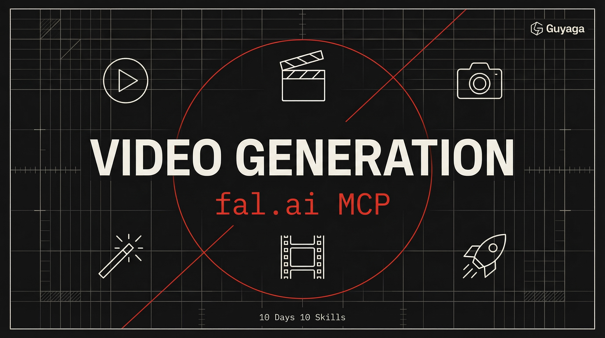

<p align="center">
  
</p>

<h1 align="center">Day 5 — AI Video Generation</h1>
<p align="center">
  <strong>10 Days 10 Skills</strong> · Claude Code Course by <a href="https://bestguy.ai">Guy Aga</a>
</p>
<p align="center">
  
  
  
</p>

---

## What is This?

This skill connects Claude Code to **fal.ai** — a platform with the world's best AI video models. Generate videos from text descriptions or images, using models like **Veo 3.1**, **Kling 3**, **Seedance**, and more.

This lesson also introduces **MCPs** — plugins that give Claude Code superpowers by connecting it to external services.

### What Can You Do With It?

| You Say | What Happens |
|---------|-------------|
| "Generate a 5-second video of a sunset" | Text → AI video via Veo 3.1 |
| "Animate this product image" | Your image → smooth video via Kling 3 |
| "Create first frame, then animate it" | Day 1 image gen → Day 5 video gen |
| "Make a cinematic intro for my brand" | Full production with all skills |

### What is an MCP?

Think of MCPs as **plugins for Claude Code**. Just like browser extensions add features to Chrome, MCPs add capabilities to Claude. In this case, the fal.ai MCP gives Claude access to 1000+ AI models — including the best video generators.

One command to install. Then Claude can use it.

---

## Prerequisites

- [ ] **Claude Code** (Pro or Max subscription)
- [ ] **fal.ai account** (requires credits — start with $5-10)
- [ ] **fal.ai API Key**

> **This skill costs money per video.** Video generation is more expensive than images. A 5-second video can cost $0.35 - $2.00 depending on the model. See pricing table below.

---

## Step 1: Create a fal.ai Account

1. Go to [fal.ai](https://fal.ai) and sign up

---

## Step 2: Get Your API Key

1. Go to **https://fal.ai/dashboard/keys**
2. Click **Create Key**
3. Copy the key (looks like `xxxx-xxxx:xxxxxxxxxxxx`)

---

## Step 3: Add Credits

1. Go to **https://fal.ai/dashboard/usage-billing/credits**
2. Add $5-10 to start (enough for ~20-50 test videos)

---

## Step 4: Install the fal MCP (Run in Terminal — NOT inside Claude Code)

**Close Claude Code first.** Open a regular terminal (PowerShell, Terminal, Command Prompt) and run:

```bash
claude mcp add --transport http fal-ai https://mcp.fal.ai/mcp --header "Authorization: Bearer YOUR_FAL_KEY"
```

Replace `YOUR_FAL_KEY` with your actual API key from Step 2.

> **Why outside Claude Code?** The `claude mcp add` command configures Claude Code itself — it can't configure itself from the inside. Like installing a browser extension — you do it from outside the browser.

---

## Step 5: Restart Claude Code & Install Skill

1. **Close and reopen Claude Code** — the fal MCP loads on startup
2. Open Claude Code and paste:

```
Install the fal-ai-video-generation skill from https://github.com/guyaga/10d10s-day04-video-generation and verify the fal MCP is connected by searching for available video models.
```

If it works, Claude will show you available models like Veo 3.1, Kling 3, etc.

---

## Available Video Models & Pricing

> **AI video can be pricy** — but it's still dramatically cheaper than hiring a production crew. Always check your prompt, image quality, and model choice before generating.

### Premium Quality

| Model | Price/sec | Best For |
|-------|-----------|----------|
| **Veo 3.1** | $0.20-0.40/s | Highest quality, Google's flagship |
| **Kling 3 Pro** | $0.11-0.20/s | Cinematic, native audio support |

### Balanced Quality

| Model | Price/sec | Best For |
|-------|-----------|----------|
| **Kling 2.5 Turbo** | ~$0.07/s | Speed + quality balance |
| **Kling Omni O1** | Varies | Style-guided generation |
| **Seedance 1.5 Pro** | Varies | Motion + dance |
| **Minimax Hailuo-02** | Varies | Latest Minimax |

### Budget / Fast

| Model | Price/sec | Best For |
|-------|-----------|----------|
| **Veo 3.1 Lite** | Cheaper | Budget Veo option |
| **LTX-2 19B** | Varies | Image-to-video with audio |

### Cost Examples

| What You Generate | Model | Duration | Approx Cost |
|-------------------|-------|----------|-------------|
| Quick test | Kling 2.5 | 5 sec | ~$0.35 |
| Good quality | Kling 3 | 5 sec | ~$0.70 |
| Premium | Veo 3.1 + audio | 8 sec | ~$3.20 |

**Tip:** Test with budget models first. Use premium for the final render.

---

## How to Use It

### Generate Video from Text

```
Generate a 5-second video using Veo 3.1:
"A slow aerial drone shot over a futuristic city at sunset, neon lights reflecting on glass buildings, cinematic, 4K quality"
```

### Generate Video from Image (Best Results)

```
First, generate an image with nano-banano-pro:
"A professional woman standing at a modern podium, tech conference, dramatic stage lighting"

Then animate it with Kling 3 Pro:
"She begins speaking confidently, subtle hand gestures, camera slowly zooms in, audience lights in background"
```

### First + Last Frame (Most Control)

```
1. Generate first frame: "A closed laptop on a minimal desk, morning light"
2. Generate last frame: "Same laptop now open showing a dashboard, coffee cup appeared beside it"
3. Use Veo 3.1 to generate the video transition between these two frames
```

### Full Pipeline (Days 1-5 Combined)

```
Let's create a complete product video:

1. Generate a hero image of my product using nano-banano-pro (Day 1)
2. Animate it into a 5-second video with Kling 3 (Day 5)
3. Check the video quality with ai-video-analyzer (Day 2)
4. Add subtitles and trim with ai-video-editor (Day 3)
5. Generate voiceover and add narration with ai-voice-audio (Day 4)

Save the final video to D:/Videos/product-final.mp4
```

---

## Before You Generate (Checklist)

Run through this **every time** to avoid wasting credits:

- [ ] Is my prompt specific? (motion, camera, mood, duration)
- [ ] Is my input image high quality? (2K minimum for image-to-video)
- [ ] Am I using the right model? (budget for tests, premium for final)
- [ ] Is the duration reasonable? (start with 4-5 seconds)
- [ ] Do I have enough credits? (check https://fal.ai/dashboard/usage-billing/credits)

---

## Prompting Tips

### Describe Motion
"Camera slowly pans left, wind blows through trees, birds fly across frame"

### Specify Camera
"Aerial drone shot", "close-up macro", "handheld documentary style", "smooth dolly zoom"

### Set Duration & Mood
"8 seconds, cinematic, dramatic lighting" or "5 seconds, energetic, social media"

### For Image-to-Video
Describe what **changes** — don't repeat what's already visible. "She turns to face camera, wind catches her hair" not "a woman standing in a field"

---

## Troubleshooting

| Problem | Solution |
|---------|----------|
| "MCP not connected" | Restart Claude Code after adding the MCP |
| "Authorization failed" | Check your API key at https://fal.ai/dashboard/keys |
| "Insufficient credits" | Add credits at https://fal.ai/dashboard/usage-billing/credits |
| Video looks bad | Check input image quality, make prompt more specific |
| Too expensive | Use Kling 2.5 or Veo 3.1 Lite for tests |

---

## Links

- [fal.ai — Sign Up](https://fal.ai)
- [fal.ai API Keys](https://fal.ai/dashboard/keys)
- [fal.ai Credits](https://fal.ai/dashboard/usage-billing/credits)
- [fal MCP Docs](https://fal.ai/docs/documentation/setting-up/mcp)
- [fal Video Models](https://fal.ai/models?categories=video)
- [Course Page — bestguy.ai](https://bestguy.ai/course/10-days-10-skills)
- [HTML Skill Guide (Hebrew)](https://bestguy.ai/course/guides/day05-video-generation.html)

---

<p align="center">
  <strong>10 Days 10 Skills</strong> — Claude Code Course<br>
  <a href="https://bestguy.ai">bestguy.ai</a> · Guy Aga © 2026
</p>
